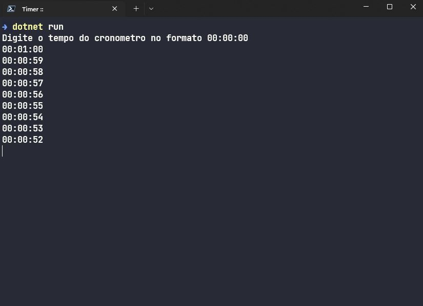
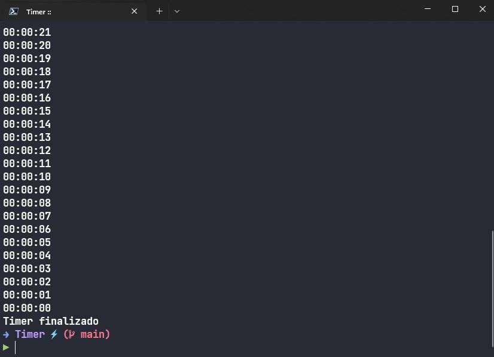

# Projeto de Console - Timer
### Projeto criado para testar algumas funcionalidades básicas do C#.
---

## Como rodar:
- Foi utilizado o .NET6 para o desenvolvimento da aplicação.
    - Clone o repositório do projeto
    - Abra a pasta do projeto com o terminal e digite o comando:
        ```
        dotnet restore
        ```
    - Em seguida digite o comando:
        ```
        dotnet run
        ```
    - Siga os passos dentro da aplicação

## Prints do projeto:

